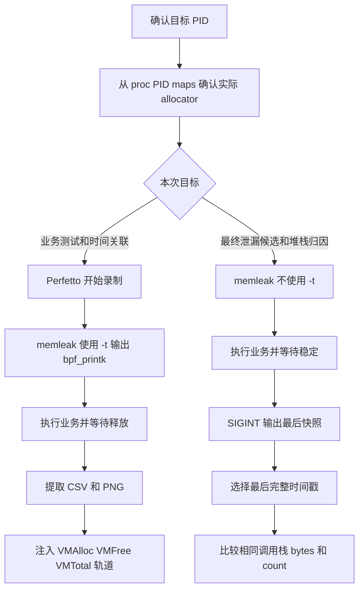

# Android arm64 memleak

本文档描述本仓库相对于 AOSP Android 15 原始 BCC `memleak` 的更新、
Android arm64 构建方式、运行前提和命令行用法。

## 适用范围

- 源码目录：`external/bcc/libbpf-tools`。
- 目标平台：Android 15、arm64。
- 目标程序：基于 libbpf skeleton 的 `memleak`，不是 `tools/memleak.py`。
- 默认用户态 allocator：Android Bionic `/system/lib64/libc.so`。
- 默认不指定 `-p` 或 `-c` 时，跟踪的是内核内存分配，而不是某个应用进程。

运行时通常需要 root、可用的 BPF 功能、tracefs，以及内核 BTF
`/sys/kernel/btf/vmlinux`。SELinux 或设备内核策略仍可能阻止 BPF 程序加载或
uprobe 挂载。

## 本次更新

`memleak.c`、`memleak.bpf.c` 和 `memleak.h` 以 BCC v0.37.0 为依据，
将 AOSP 中较旧的 2023 年版本更新到当前业务逻辑，同时保留 Android 现有的
`argp` 和符号解析兼容层。主要变化如下：

- 修正 `posix_memalign` 临时指针 map 的 key 宽度，避免 BPF verifier 拒绝程序。
- 不再把 `mmap()` 返回的 `MAP_FAILED` 记录为成功分配。
- 增加 `mremap()` 跟踪。
- 只在使用 `-C` 时分配和维护 combined allocation map。
- 过滤无效 stack id，并在 stack map 容量不足或发生 hash collision 时给出警告。
- 增加 `--stack-storage-size` 和 `--perf-max-stack-depth`。
- 修复 `-p`、`-o`、`-T` 的非法参数及 `-o` 溢出处理。
- 增加 `-S`，支持带符号前缀的第三方 allocator，例如 jemalloc。
- 修正 `uprobe_helpers.c` 的文件资源释放路径。
- 默认 libc 从 Linux glibc 的 `libc.so.6` 改为 Android arm64 Bionic 的
  `/system/lib64/libc.so`。
- 将 `-O/--obj` 的 allocator ELF 路径缓冲区从 32 字节扩大到 `PATH_MAX`，
  支持直接传入 Android APEX 中较长的 HWASan libc 路径，不再需要短路径软链接；
  超过 `PATH_MAX - 1` 时会明确报错，不再静默截断。
- `Android.bp` 增加 BPF object、skeleton 和 `memleak` binary，并将 binary
  配置为全静态可执行文件。BPF object 已嵌入 skeleton，设备运行时不需要另行
  推送 `memleak.bpf.o`。

本次没有更新 AOSP 的 libbpf。Android 15 源码中的 libbpf 1.4 已提供本次
`memleak` 更新使用的 API，例如 `bpf_program__attach_uprobe_opts()`、
`bpf_map__set_value_size()` 和 `bpf_map__set_max_entries()`。

## 构建和部署

将本仓库内容集成到 AOSP 的 `external/bcc` 后，在 AOSP 构建环境中执行：

```sh
source build/envsetup.sh
lunch <product>-<release>-<variant>
m memleak
```

将生成的 arm64 `memleak` 推送到设备：

```sh
adb root
adb push <path-to-built-memleak> /data/local/tmp/memleak
adb shell chmod 0755 /data/local/tmp/memleak
```

如果设备不允许 `adb root`，需要使用设备已有的 root 方案执行后续命令。

## 基本用法

### QRD8750 Camera Provider：HWASan 实机示例

已验证设备上的 `vendor.qti.camera.provider-service_64` 是 HWASan 进程，
实际映射的 allocator ELF 是：

```text
/apex/com.android.runtime/lib64/bionic/hwasan/libc.so
```

推荐从设备的 root shell 执行：

```sh
/data/local/tmp/memleak \
  -p "$(pidof -s vendor.qti.camera.provider-service_64)" \
  -O /apex/com.android.runtime/lib64/bionic/hwasan/libc.so \
  --stack-storage-size 65536 \
  -T 20 1
```

若从主机直接执行，要用单引号保证 `pidof` 在 Android 设备而不是主机上展开：

```sh
adb shell '/data/local/tmp/memleak -p "$(pidof -s vendor.qti.camera.provider-service_64)" -O /apex/com.android.runtime/lib64/bionic/hwasan/libc.so --stack-storage-size 65536 -T 20 1'
```

普通、非 HWASan 的 Android arm64 进程通常使用以下命令：

```sh
/data/local/tmp/memleak \
  -p "$(pidof vendor.qti.camera.provider-service_64)" \
  -O /system/lib64/libc.so \
  --stack-storage-size 65536 \
  -T 20 1
```

第二条命令只用于说明普通 Bionic libc 的写法，不能用于上述 HWASan Camera
Provider。实测对该进程指定 `/system/lib64/libc.so` 时，uprobes
可以创建且程序会显示 `Attaching to pid`，但由于目标进程没有映射这个 ELF，
业务过程中会持续输出 `Top 0`，造成“工具运行正常但没有采到数据”的假象。

#### 先确认目标进程实际使用的 libc

不要只根据产品是否为 Android 来猜测 libc 路径，应检查目标进程的 maps：

```sh
PID="$(adb shell pidof -s vendor.qti.camera.provider-service_64)"
adb shell "grep 'libc.so' /proc/$PID/maps"
```

HWASan 实机应看到类似：

```text
/apex/com.android.runtime/lib64/bionic/hwasan/libc.so
```

选择规则如下：

| `/proc/PID/maps` 中的实际映射 | `-O` 应指定的路径 |
| --- | --- |
| `/apex/com.android.runtime/lib64/bionic/hwasan/libc.so` | 同一条完整 HWASan libc 路径 |
| `/apex/com.android.runtime/lib64/bionic/libc.so` | `/system/lib64/libc.so` 或 maps 中的完整 APEX 路径 |
| 第三方 allocator，例如 jemalloc | 目标进程实际映射的 allocator ELF，并按需配合 `-S` |

`-O` 的文件必须与目标进程实际映射的文件一致。路径看起来相似、导出同名函数，
并不表示它们是同一个 uprobe 目标。当前版本的 `-O` 路径缓冲区容量为
`PATH_MAX`，最大可接收 `PATH_MAX - 1` 字节，因此不需要在 `/data/local/tmp`
创建 libc 软链接。

如果 `pidof` 返回多个 PID，`-p` 无法接收一串 PID。应先确认要跟踪的实例，或
用 `pidof -s` 只取一个 PID：

```sh
pidof -s vendor.qti.camera.provider-service_64
```

若进程尚未启动，或运行过程中 PID 因服务重启而变化，必须重新启动 `memleak`
并附着新 PID。

#### 示例命令逐项解释

| 命令部分 | 含义 |
| --- | --- |
| `/data/local/tmp/memleak` | 全静态 ARM64 用户态程序；BPF object 已通过 skeleton 嵌入二进制。 |
| `-p "$(pidof ...)"` | 在命令执行时查找 Camera Provider PID，并只跟踪该 PID 的用户态 allocator 调用。 |
| `-O .../hwasan/libc.so` | 在目标实际映射的 HWASan Bionic libc 上挂载 malloc/free/calloc/realloc/mmap 等 uprobes。 |
| `--stack-storage-size 65536` | stack trace map 最多保存 65536 条唯一调用栈；它不是调用栈深度，也不是输出条数。 |
| `-T 20` | 每次报告按 outstanding bytes 从大到小排序，只打印前 20 个 allocation stacks。 |
| 最后的 `1` | 第一个位置参数 `INTERVAL`，表示每 1 秒生成一次报告。 |

示例末尾只有一个位置参数，因此会持续运行，直到按 `Ctrl+C` 或收到 `SIGINT`。
若只想等待 1 秒并输出一次，需再增加第二个位置参数 `INTERVALS`：

```sh
/data/local/tmp/memleak \
  -p "$(pidof -s vendor.qti.camera.provider-service_64)" \
  -O /apex/com.android.runtime/lib64/bionic/hwasan/libc.so \
  --stack-storage-size 65536 \
  -T 20 1 1
```

其中第一个 `1` 是输出间隔，第二个 `1` 是输出次数。

#### 已确认的两条虚拟内存工作流

Camera Provider 的虚拟内存工作已经收敛为两条互补主线。两条链路使用同一个
memleak BPF address map，但输出目标不同，不建议为了“一次拿全”而长期同时打开
`-a`、`-t`、全 size 和高频周期报告。

| 方向 | 核心输出 | 更适合回答的问题 | 主要不足 |
| --- | --- | --- | --- |
| 方向一：`bpf_printk + Perfetto` 测试 | 与业务 trace 同时间轴的 VM 曲线、CSV、PNG | 哪个业务阶段发生申请/释放；峰值、回落和重复操作趋势如何 | trace 事件本身没有调用栈；`bpf_printk` 不保证高频无损 |
| 方向二：纯 memleak 分析 | 最后完整 outstanding 快照及申请调用栈 | 业务结束后还剩什么；候选来自 CamX/CHI/CSL、线程还是 HWASan 哪条路径 | 不具备 Perfetto 业务切片的精细时间关联 |



##### 方向一：`bpf_printk + Perfetto` 业务测试

这个方向把 memleak 的 alloc/free 事件当作业务 trace 的一个数据源。它重在测试：
把 Camera open、configure、preview、capture、flush、close 等业务 slice 与 VM 峰值
和释放时刻放在同一时间轴上，观察多次操作后曲线是否回到相同底座。

当前配套的跨平台主机启动器位于
`perf_tools/android/memory/run_memleak.py`。默认进程名、size、stack map、Top 数和
间隔等价于：

```sh
/data/local/tmp/memleak \
  -p "$(pidof -s vendor.qti.camera.provider-service_64)" \
  -O /system/lib64/libc.so \
  --stack-storage-size 65536 \
  -t -z 262144 -T 1 3600
```

QRD8750 的 HWASan Camera Provider 日常只需要指定 allocator 简写：

```sh
cd /path/to/perf_tools/android/memory
python3 run_memleak.py --hwasan
```

其中 `-t` 把成功 alloc 和已匹配 free 的 address/size 写入 `bpf_printk`；
`-z 262144` 只跟踪单次大小至少 256 KiB 的申请；`-T 1 3600` 让 stdout 周期报告
保持低频，不影响逐事件写入。末尾没有 `INTERVALS`，所以持续运行到 `Ctrl+C`。

Perfetto 侧配套脚本位于 `perf_tools/android/perfetto`：

| 脚本 | 场景 | Trace 格式 |
| --- | --- | --- |
| `2.catch-in_tree-short_trace.sh/.bat` | in-tree 短 trace | compressed |
| `3.catch-in_tree-long_trace.sh/.bat` | in-tree 长 trace | decompressed |
| `4.catch-out_of_tree-short_trace.sh/.bat` | out-of-tree 短 trace | compressed |
| `5.catch-out_of_tree-long_trace.sh/.bat` | out-of-tree 长 trace | decompressed |

脚本 2～5 在 trace 拉取后都会依次运行：

```sh
python3 analys/sql/analys_vmalloc.py \
  -f <trace> -o <output_dir>

python3 analys/perfetto/inject_vmalloc.py \
  -t <trace> -c <output_dir>/vm_raw_events.csv -o <trace>
```

`analys_vmalloc.py` 默认只分析
`vendor.qti.camera.provider-service_64`，生成：

- `vm_raw_events.csv`：逐条 alloc/free 的时间戳、PID/TID、address 和 size；
- `vm_summary.csv`：事件数、峰值、结束值、未释放地址数和异常配对统计；
- `process_<pid>_vmalloc_analysis.png`：VMAlloc、VMFree、VMTotal 曲线。

`inject_vmalloc.py` 会在原 trace 中增加五条 Perfetto counter 轨道：

| 轨道 | 含义 |
| --- | --- |
| `VMAlloc` | trace 观测范围内成功申请字节数的累计曲线 |
| `VMFree` | memleak 已匹配释放字节数的累计曲线 |
| `VMTotal` | 按 address map 重建的当前 outstanding 曲线 |
| `VMAlloc Value` | 每次申请 size 的短脉冲竖线 |
| `VMFree Value` | 每次释放 size 的短脉冲竖线 |

推荐用两个终端保证事件窗口完整：

1. 先启动脚本 2～5，让 Perfetto 进入录制；
2. 再启动 `run_memleak.py --hwasan`，等待启动器显示 memleak 正在前台运行；
3. 执行业务，并在 Camera 关闭后等待释放稳定；
4. 保持 Perfetto 仍在录制，先按 `Ctrl+C` 停止 memleak；
5. 再停止 Perfetto，等待 CSV/PNG 生成和 VM 轨道注入完成。

`run_memleak.py` 把 memleak stdout/stderr 重定向到
`/data/local/tmp/mlk_evt.log`，所以主机启动终端不会直接显示
`Attaching to pid`。对附着时刻有严格要求时，可从另一个终端确认：

```sh
adb shell grep 'Attaching to pid' /data/local/tmp/mlk_evt.log
```

如果 memleak 早于 Perfetto 启动，trace 中可能先看到某个 address 的 free、却没有
看到对应 alloc。分析器会根据这种 free 推断 trace 起点已有的已知 allocation，
避免简单地把 VMTotal 算成负数；但在 trace 前申请、且 trace 结束时仍未释放的
对象不会产生任何 trace 事件，仍然无法恢复。因此 VMTotal 是本次 memleak/trace
观测窗口的虚拟内存曲线，不是目标进程完整 VSS，也不等同于 RSS/PSS。

测试链路重点看：业务 slice 附近的 VMTotal 峰值、close 后的回落速度、重复操作后
底座是否逐轮抬升。VMAlloc 和 VMFree 是累计量，本身不会回落；不能仅因为 VMAlloc
持续上升就判断泄漏。

##### 方向二：纯 memleak 最终快照分析

这个方向不使用 `-t`，让 memleak 专注维护 outstanding address map、保存申请
stack id 并周期性符号化。它重在分析：业务结束后查看最后一个完整时间戳，利用
调用栈定位仍未释放的候选来源。

推荐的底层命令是：

```sh
/data/local/tmp/memleak \
  -p "$(pidof -s vendor.qti.camera.provider-service_64)" \
  -O /apex/com.android.runtime/lib64/bionic/hwasan/libc.so \
  --stack-storage-size 65536 \
  -z 262144 -T 50 5
```

当前配套的跨平台脚本位于
`perf_tools/android/memory/memleak_leak_check.py`：

```sh
cd /path/to/perf_tools/android/memory

# QRD8750 HWASan Camera Provider
python3 memleak_leak_check.py --hwasan

# 普通 Bionic libc 是默认值
python3 memleak_leak_check.py
```

脚本会等待 `Ctrl+C`，然后只向本次设备端 memleak PID 发送 `SIGINT`，等待最后报告
刷新和 BPF links 清理，拉取日志并验证最后报告是否完整。默认输出目录包含：

- `memleak.log`：完整原始输出；
- `timeline.csv`：每个报告的完整性和显示范围 bytes/count；
- `last_snapshot.csv`：最后完整快照的候选栈；
- `last_snapshot.txt`：可读摘要和完整调用栈。

该模式保持默认 `sample-rate=1`，不建议为泄漏否定结论使用 `-s` 抽样；默认不使用
`-a`，避免输出大量 address；默认不使用 `-t`，避免逐事件 trace 开销。`-T 50`
只限制用户态显示的聚合栈数量，不减少 BPF 侧 address map 的实际跟踪量。需要只看
长寿命候选时可使用：

```sh
python3 memleak_leak_check.py --hwasan --older-ms 10000
```

2026-08-06 HWASan 实测中，首个报告为 321,172,992 bytes/44 allocations；5 秒后
回落到 1,064,960 bytes/1 allocation，并在之后约 43 秒、10 个连续报告中完全
稳定，即显示范围内约 99.67% 已释放。最终残留栈经过
`__allocate_thread_mapping` → `pthread_create` →
`CamX::OsUtils::ThreadCreateWithAttr`，并位于 BITML/Camera teardown 路径。

这份 1.02 MiB 映射在不同测试中重复出现，值得作为候选跟踪；但单轮没有继续增长，
不能直接定性为泄漏。更可靠的判据是在同一次附着中重复 5～10 轮 Camera
打开/关闭：如果关闭后始终稳定为一份，更像常驻线程、缓存或 HWASan 保留映射；
如果相同栈逐轮累积为 2、3、4 份，则形成线程生命周期泄漏的强证据。

BPF 在申请成功时以 address 为 key 保存 size、时间戳和申请 stack id；在
`free()`/`munmap()` 时按 address 查找并删除。因此纯 memleak 的 outstanding 是
通过 address map 中是否仍存在记录判断，不是简单用累计 alloc 次数减 free 次数。

##### 方向一的低层排障补充

不经过 Perfetto 时，也可以用 `-a` 查看当前 outstanding 对象的 address/size，
或直接消费 `trace_pipe` 查看 `-t` 事件。但 `trace_pipe` 是消费式接口，不应与
Perfetto reader 同时使用：

```sh
adb shell 'cat /sys/kernel/tracing/trace_pipe | grep -E "alloc entered|alloc exited|free entered"'
```

当前能力边界如下：

| 信息 | 当前版本 |
| --- | --- |
| alloc/free address 和 size | `-t` 可输出；free size 来自原申请 address map。 |
| outstanding 对象 address | `-a` 可在周期报告中显示。 |
| 申请调用栈 | 可以；申请成功时保存 stack id。 |
| free 调用栈 | 不支持；`gen_free_enter()` 当前没有调用 `bpf_get_stackid()`。 |
| 高频事件无损性 | 不保证；`bpf_printk` 没有事件丢失计数。 |

若后续需要 free stack、结构化事件和可量化丢失率，应增加独立 BPF ring buffer
模式，而不是把 `bpf_printk` 当成长时间无损事件通道。

##### 性能与完整性的取舍

- 方向二每次申请仍会执行 uprobe、map 更新和用户栈采集，但不会输出每次事件；
  它是最终 outstanding 和调用栈归因的首选。
- `-a` 的额外成本主要在用户态遍历、保存和输出每个 outstanding 地址，适合短时
  缩小范围后的诊断。
- `-t` 为每个匹配事件调用 `bpf_printk`，高频 Camera Provider 上应同时使用
  `-z/-Z` 或短时间窗口，不应作为常驻模式。
- `-s N` 能进一步降低采集量，但会放弃全量配对，只适合统计型性能分析，不适合
  对“是否存在少量泄漏”作否定结论。
- 本次三种观测下 Snapcam 冷启动 `TotalTime` 分别约为 408 ms、388 ms 和
  419 ms，未观察到启动失败或明显卡顿；这只是功能性冒烟结果，不是与 malloc
  debug 的严格性能基准。正式评估仍需固定版本和场景做多轮耗时、CPU 占用对比。

#### 方向二的纯 memleak 手工观测流程

1. 停止 Snapcam、回到桌面，确认 Camera Provider PID。
2. 启动 `memleak`，等待出现 `Attaching to pid ...` 和第一条周期报告。
   uprobe 初始化可能耗时数秒；业务动作必须在确认附着完成后开始。
3. 静置 2 秒，记录空闲基线。
4. 启动 Snapcam，等待预览稳定后拍照。
5. 拍照后等待 3 秒，回到桌面，再静置 2 秒。
6. 按 `Ctrl+C` 结束；后台运行时发送 `SIGINT`，不要直接依赖强制杀进程。

此前一轮基础功能验证时间线如下：

```text
22:59:26 sequence_start_attached
22:59:28 launch_snapcam
22:59:30 take_photo
22:59:33 return_home
22:59:35 observation_stop
```

生成的照片为 `/sdcard/DCIM/Camera/IMG_20260804_225931.jpg`。空闲阶段输出
`Top 0`，启动相机后变为 `Top 20`，证明 HWASan libc uprobes 已捕获 Camera
Provider 的实际分配事件。

### 如何解析输出

典型输出结构如下：

```text
Attaching to pid 1779, Ctrl+C to quit.
[22:59:29] Top 20 stacks with outstanding allocations:
738197504 bytes in 44 allocations from stack
        0 [...] __init_additional_stacks... [/apex/.../hwasan/libc.so]
        1 [...] __pthread_start...       [/apex/.../hwasan/libc.so]
37695488 bytes in 24 allocations from stack
        0 [...] CamX::OsUtils::MemMap... [/vendor/lib64/libcamxcommonutils.so]
        1 [...] UnBatchPackets...        [/vendor/lib64/libcamxcsl.so]
        3 [...] CSLAlloc...              [/vendor/lib64/libcamxcsl.so]
```

各字段含义：

- `[22:59:29]` 是本次报告生成的设备本地时间。
- `Top 20` 表示本次最多展示 20 个栈；若只有 11 个有效栈，会显示 `Top 11`。
- `738197504 bytes` 是采样时该调用栈下尚未观察到释放的分配大小总和。
- `44 allocations` 是该调用栈下尚未释放的分配次数。
- 栈帧编号 `0` 是最靠近分配调用的位置，后续编号逐步向调用者展开。
- 方括号末尾是符号所属 ELF。Camera 场景常见
  `camera.qcom.so`、`libcamx*.so`、`com.qti.chi.override.so` 和 HWASan libc。

`outstanding` 只表示从本次 memleak 附着后捕获、在当前报告时仍未匹配到释放的
分配。它不等于进程 RSS/PSS，也不能仅凭一次报告认定为永久泄漏。工具无法回溯
附着之前已经发生的分配。

#### HWASan 结果的特殊含义

HWASan Camera Provider 中可能看到很大的
`__init_additional_stacks`、`__allocate_thread_mapping` 或 `mmap` 数值。这些通常
包含 HWASan 线程栈、保护区或大块虚拟地址映射。例如本次实测出现
`738197504 bytes in 44 allocations`，不能直接解释为新增了 738 MB 的物理内存。
在 memleak 分析中应把这些 HWASan 基础设施栈单独归类，重点比较它们在重复业务
后的 outstanding count 是否回落或逐轮增长；不要让它们遮蔽 CamX/CHI/CSL 等
业务申请栈。

CamX 的 `OsUtils::MemMap -> CSLAlloc -> ImageBufferManager` 一类栈通常对应相机
pipeline buffer、命令缓冲区或硬件资源池。它们在相机打开时快速增长、关闭后
回落或保持稳定，可能是正常缓存；只有在重复相同业务循环后持续阶梯式增长、
关闭相机后也不回落，才更值得作为泄漏候选继续分析。

建议比较至少三个阶段：

| 阶段 | 关注点 |
| --- | --- |
| 启动前空闲基线 | 是否已经存在持续增长的后台分配。 |
| 打开、预览和拍照 | 哪些 stack 首次出现，bytes/count 增长幅度。 |
| 回桌面后的稳定阶段 | 相同 stack 是否释放、稳定，或继续增长。 |

不要只做一次拍照。更可靠的方法是重复相同的打开、拍照、关闭流程，比较同一
stack 的 bytes/count 是否随循环次数单调增长。还可以使用 `-o` 排除寿命很短的
正常分配，例如只显示至少存活 10 秒的分配：

```sh
/data/local/tmp/memleak \
  -p "$(pidof -s vendor.qti.camera.provider-service_64)" \
  -O /apex/com.android.runtime/lib64/bionic/hwasan/libc.so \
  --stack-storage-size 65536 \
  -o 10000 -T 20 5
```

#### 常见警告和异常结果

- `valloc`/`pvalloc` 在 Bionic HWASan libc 的符号值可能为 0，libbpf 会打印
  `should not be 0 in a shared library`。只要后续出现 `Attaching to pid` 并能在
  业务动作后输出实际 allocation stacks，该警告不是本次观测失败。
- `WARNING: ... stack traces could not be displayed ... hash collisions` 表示 stack
  trace map 容量或哈希冲突造成部分栈丢失。配套脚本当前使用 65536，但仍不保证
  每轮都没有冲突；告警数字可能按缺少有效 stack id 的 allocation record 计数，
  不一定等于唯一调用栈数量。更大的 map 会占用更多 BPF locked memory。出现该
  警告的报告不能视为完整栈集合。
- 持续 `Top 0` 可能只是目标空闲，也可能是 `-O` 指向了目标未映射的 libc。
  应先确认已经出现 `Attaching to pid`，再通过 `/proc/PID/maps` 核对 allocator，
  并触发确定会产生分配的业务动作。
- `failed to load bpf object`、`failed to attach uprobes` 或 verifier 日志属于加载/
  附着失败，与正常的 `Top 0` 含义不同。检查 root、SELinux、BTF、tracefs 和内核
  BPF 配置。
- 当前 `realloc`/`mremap` 在入口先删除旧地址，若操作最终失败，旧对象实际仍然
  有效但可能已从 outstanding map 移除；失败路径存在低估风险。`munmap` 失败和
  partial unmap 也不能完全等同于简单的 address 删除。分析复杂失败场景时需要
  结合实现限制，不应把一次 `Top 0` 当成“绝对没有泄漏”的证明。

### 手工保存 QRD8750 实机日志

日常执行方向二时优先使用前述 `memleak_leak_check.py`；下面保留没有配套
`perf_tools` 环境时的底层手工方式。

当前程序没有 `-f` 参数。下面的命令把 stdout 和 stderr 一起写入设备文件：

```sh
adb shell 'LOG=/data/local/tmp/memleak_camera_$(date +%Y%m%d_%H%M%S).log; /data/local/tmp/memleak -p "$(pidof -s vendor.qti.camera.provider-service_64)" -O /apex/com.android.runtime/lib64/bionic/hwasan/libc.so --stack-storage-size 65536 -T 20 1 >"$LOG" 2>&1'
```

前台按 `Ctrl+C` 后，可使用 `adb pull` 拉取日志。若通过后台方式运行，应记录
memleak 自身 PID，并用 `SIGINT` 结束，以便程序输出最后一次报告并正常清理 BPF
links。

### 按进程名跟踪

当前程序只接受 PID，不直接接受进程名。Android Toybox 的 `pidof -s` 可以把
进程名转换为单个 PID：

```sh
adb shell '/data/local/tmp/memleak -p $(pidof -s com.example.app) -T 20 5'
```

这条命令每 5 秒输出一次，按照未释放字节数排序，仅显示前 20 个 allocation
stack。若应用尚未启动，`pidof` 会返回空值，必须先启动应用再执行。

也可以先确认 PID，再显式传入：

```sh
adb shell pidof com.example.app
adb shell '/data/local/tmp/memleak -p 12345 -T 20 5'
```

### 限定分配年龄和大小

下面的例子每 10 秒输出一次，只统计至少存在 30 秒、大小在 4 KiB 到 1 MiB
之间的 outstanding allocations：

```sh
adb shell '/data/local/tmp/memleak -p 12345 -o 30000 -z 4096 -Z 1048576 -T 30 10'
```

`memleak` 展示的是采样时仍未释放的分配，不能仅凭一次输出断定它一定是永久
泄漏。通常应观察同一 allocation stack 的 outstanding bytes 和 allocation
count 是否持续增长。

### 保存设备端日志

当前程序没有 `-f` 参数。使用 shell 重定向保存 stdout 和 stderr：

```sh
adb shell 'LOG=/data/local/tmp/memleak_log_$(date +%Y%m%d_%H%M%S).txt; /data/local/tmp/memleak -p $(pidof -s com.example.app) -T 20 5 >"$LOG" 2>&1'
```

也可以把日志直接保存在主机：

```sh
adb shell '/data/local/tmp/memleak -p $(pidof -s com.example.app) -T 20 5' > memleak_log.txt 2>&1
```

### 后台运行

当前程序没有 `-D` 参数。Android Toybox 提供 `nohup`，可以用以下方式替代：

```sh
adb shell 'LOG=/data/local/tmp/memleak_log_$(date +%Y%m%d_%H%M%S).txt; PIDFILE=/data/local/tmp/memleak_example.pid; nohup /data/local/tmp/memleak -p $(pidof -s com.example.app) -T 20 5 >"$LOG" 2>&1 </dev/null & echo $! >"$PIDFILE"'
```

停止后台任务：

```sh
adb shell 'kill -INT "$(cat /data/local/tmp/memleak_example.pid)"'
```

不要用 `pidof -s memleak` 猜测本次工具 PID；设备上同时存在多个 memleak 会话时，
它可能停止错误的实例。

### 跟踪新启动的命令

`-c` 让 `memleak` 启动并跟踪一个命令：

```sh
adb shell "/data/local/tmp/memleak -c '/data/local/tmp/alloc_test' -T 20 5"
```

### 第三方 allocator

对于带前缀的 jemalloc，可同时指定 allocator ELF 和符号前缀：

```sh
adb shell '/data/local/tmp/memleak -p 12345 -O /data/local/tmp/libjemalloc.so -S je_ -T 20 5'
```

`-O` 指定的路径必须是设备上的 ELF 路径，并且应与目标进程实际映射的
allocator 文件一致。

## 参数说明

| 参数 | 含义 |
| --- | --- |
| `-p PID`, `--pid=PID` | 跟踪一个已经运行的进程。 |
| `-c COMMAND`, `--command=COMMAND` | 启动并跟踪指定命令；不能与 `-p` 同时使用。 |
| `-T N`, `--top=N` | 每次仅输出未释放字节数最多的 N 个 allocation stacks；默认 10。 |
| `INTERVAL` | 两次输出之间的秒数；默认 5。 |
| `INTERVALS` | 输出次数；不指定时持续运行到收到信号。 |
| `-o MS`, `--older=MS` | 忽略年龄小于 MS 毫秒的分配。 |
| `-z BYTES`, `--min-size=BYTES` | 只捕获大于等于该大小的分配。 |
| `-Z BYTES`, `--max-size=BYTES` | 只捕获小于等于该大小的分配。 |
| `-s N`, `--sample-rate=N` | 每 N 次分配大约采样一次，用于降低开销；默认 1。 |
| `-a`, `--show-allocs` | 同时显示每个 outstanding allocation 的地址和大小。 |
| `-C`, `--combined-only` | 使用 BPF 侧聚合统计；不要依赖 `-a` 获取单次分配详情。 |
| `--stack-storage-size=N` | stack trace map 最多保存的唯一 stack 数；默认 10240。 |
| `--perf-max-stack-depth=N` | 每条用户栈或内核栈最多保存的 frame 数；默认 127。 |
| `-O PATH`, `--obj=PATH` | allocator ELF；默认 `/system/lib64/libc.so`。 |
| `-S PREFIX`, `--symbols-prefix=PREFIX` | allocator 函数的符号前缀，例如 `je_`。 |
| `-F`, `--wa-missing-free` | 启用 missing-free workaround。 |
| `-P`, `--percpu` | 在内核跟踪模式下启用 percpu allocator tracepoints。 |
| `-t`, `--trace` | 为每次 alloc/free 写入 BPF trace 消息，可从 trace pipe 读取。 |
| `-v`, `--verbose` | 显示 libbpf debug 日志。 |
| `--help` | 显示帮助。Android 的精简 `argp` 兼容层没有为本工具注册短参数 `-h`。 |

`-T`、`--stack-storage-size` 和 `--perf-max-stack-depth` 是三个不同概念：

- `-T` 控制最终输出多少个 allocation stacks。
- `--stack-storage-size` 控制 BPF stack map 能容纳多少条唯一 stack。
- `--perf-max-stack-depth` 控制每条 stack 最多包含多少个 frame。

## 同事样例的兼容性

原样例：

```sh
adb shell "/data/local/tmp/memleak -N {process_name} -T {MEM_LEAK_STACK_SIZE} {SAMPLE_INTERVAL} -f /data/local/tmp/memleak_log_ -D"
```

不能直接用于当前版本：

| 样例部分 | 当前版本情况 | 替代方式 |
| --- | --- | --- |
| `-N {process_name}` | 不支持 `-N`。 | 使用 `-p $(pidof -s {process_name})`。 |
| `-T {MEM_LEAK_STACK_SIZE}` | 参数存在，但含义是输出前 N 个 allocation stacks。 | 若变量表示 stack map 容量，改用 `--stack-storage-size`；若表示 stack frame 深度，改用 `--perf-max-stack-depth`。 |
| `{SAMPLE_INTERVAL}` | 兼容，作为第一个位置参数时单位为秒。 | 保持不变。 |
| `-f /data/local/tmp/memleak_log_` | 不支持 `-f`。 | 使用 `> logfile 2>&1`。 |
| `-D` | 不支持，且无法从样例判断它原本代表 daemon 还是其他功能。 | 若表示后台运行，使用 `nohup ... &`。 |

等价的当前版本命令示例：

```sh
adb shell 'LOG=/data/local/tmp/memleak_log_$(date +%Y%m%d_%H%M%S).txt; PIDFILE=/data/local/tmp/memleak_example.pid; nohup /data/local/tmp/memleak -p $(pidof -s com.example.app) -T 20 5 >"$LOG" 2>&1 </dev/null & echo $! >"$PIDFILE"'
```

其中 `20` 是每次输出的 allocation stack 数量，`5` 是输出间隔秒数。结束时读取
上述 PID 文件并发送 `SIGINT`；在配套工具环境中优先直接使用
`memleak_leak_check.py`。
